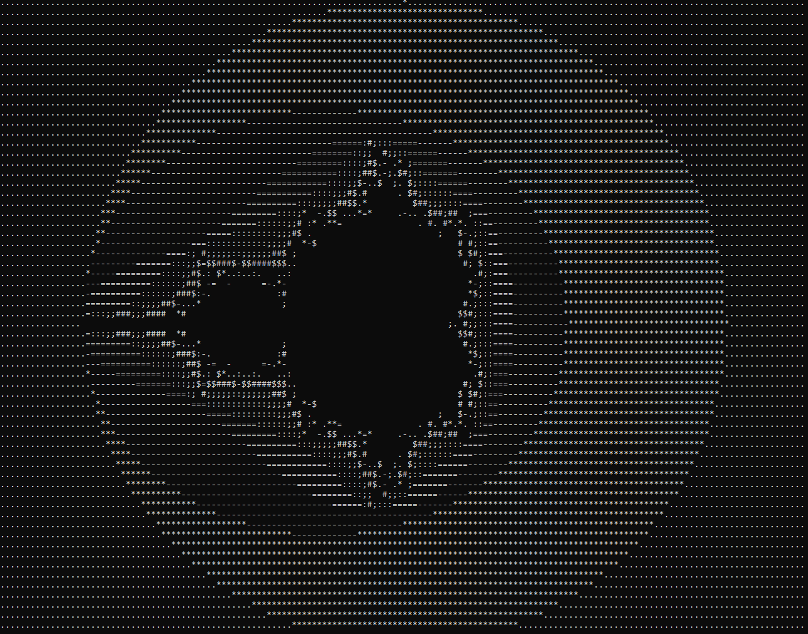

# ascii_mandelbrot

## how to build
```
gcc prog.c
```


## hint
code deobfuscated
```c
#include <stdio.h>

int main() {
    const char* chars = "..*-=:;#$";
    int max_iter = 32;
    for (int x = -32; x < 32; x++) {
        for (int y = -80; y < 80; y++) {
            float cR = (float)y / 32;
            float cI = (float)x / 16;

            float x2=0, y2=0;
            int iter = 0;

            while (x2*x2 + y2*y2 <= 4 && iter < max_iter) {
                float temp = x2*x2 - y2*y2 + cR;
                y2 = 2*x2*y2 + cI;
                x2 = temp;
                iter++;
            }
            iter < max_iter ? printf("%c", chars[iter % 10]): printf(" ");
        } putchar('\n');
    }
}
```
